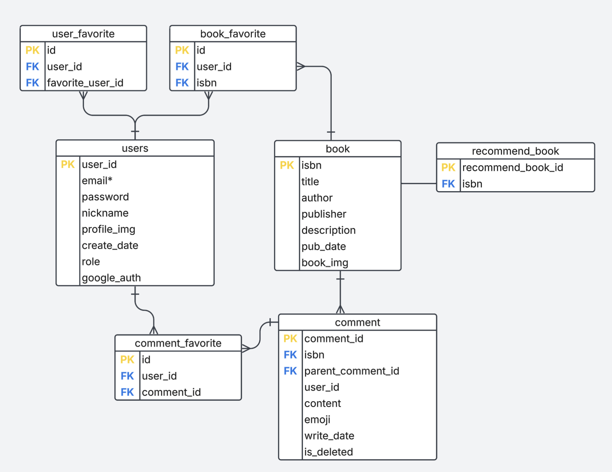

# Bookafe
## 프로젝트 소개
책에 대한 의견을 나눌 수 있는 게시판에 필요한 데이터를 다루는 `SpringBoot` 기반의 RESTful Web Service

## 개발기간
2024.10 ~ 2025.02

## 개발환경
- 언어: `JAVA 21`
- 프레임워크: `SpringBoot 3.3.4`
- 빌드도구: `Gradle`
- 데이터베이스: `MySQL 8.0`
- ORM: `Spring Data JPA`
- 인증/보안: `Spring Security`, `JWT`
- IDE: `IntelliJ IDEA`
- 형상관리: `Git`, `Github`
- 패키징: `Jar`
- 운영 플랫폼: `Docker`, `Docker compose`
- 문서화: `Notion`
- CI: `Github Actions`

## 주요 기능

### 유저 기능
- 회원가입
- 로그인(JWT 기반)
- 구글 계정으로 인증(firebase Authentication)
- 로그아웃
- 탈퇴
- 유저 즐겨찾기

### 책 기능
- 책 제목으로 검색하기
- 책 즐겨찾기 등록, 삭제 
- 오늘의 추천 책 조회
- 좋아요 top10 책 조회

### 책 리뷰 기능
- 책 리뷰 조회, 작성, 수정, 삭제
- 책 리뷰의 댓글 조회, 삭제
- 리뷰 좋아요

### 관리자 기능
- 유저 정보 조회, 삭제
- 추천 책 등록, 삭제

모든 기능은 아래 링크에서 확인 가능
https://www.notion.so/19164ab25ad180ecb31ed6cf899697f8?v=19164ab25ad180aa957e000c336a86ed&pvs=4

## 프로젝트 구조
- `api` : 컨트롤러만 위치하여 api 로직에만 집중
- `domain` : 필요한 도메인 별로 폴더를 나누고 각 도메인 별로 entity, query, repository, service 중 필요한 로직 구현
  - entity : 도메인에 필요한 엔티티
  - query : DB 쿼리 결과값 DTO
  - repository : DB 와 데이터를 주고 받는 쿼리 로직
  - service : 비즈니스 로직
- `global` : 프로젝트에서 공통적으로 사용되는 로직
  - config : 환경설정 클래스
  - dto : 요청, 응답 DTO
  - exception : 예외 클래스
  - security : JWT 관련 클래스
- `utils` : 프로젝트에서 필요한 유틸 클래스

## ERD

